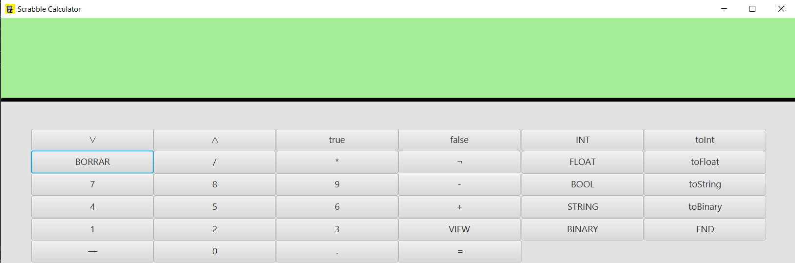
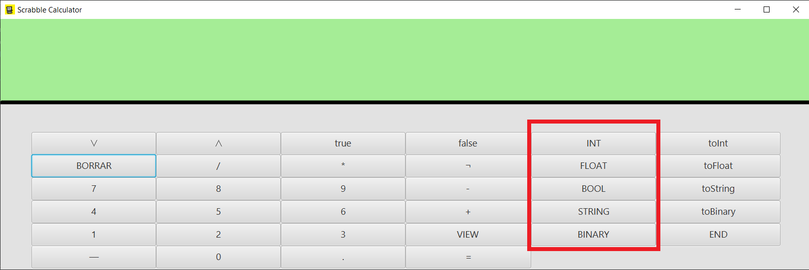
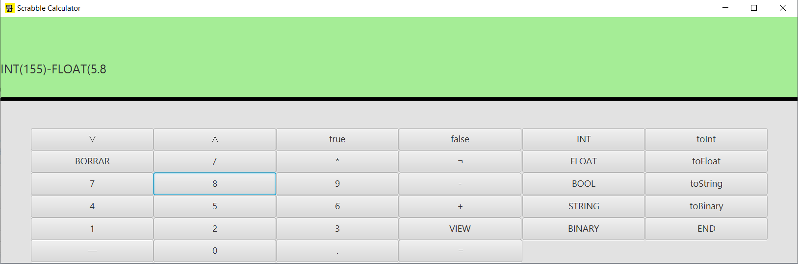
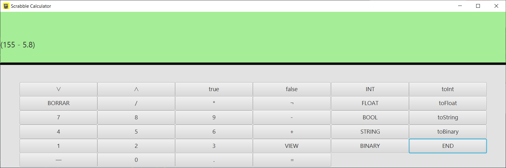
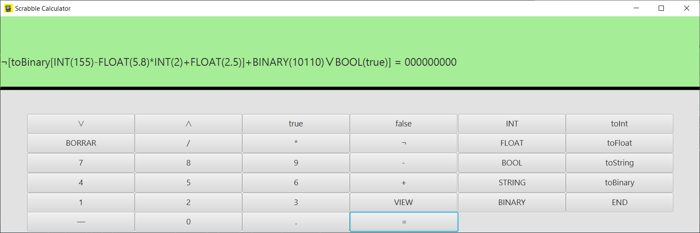
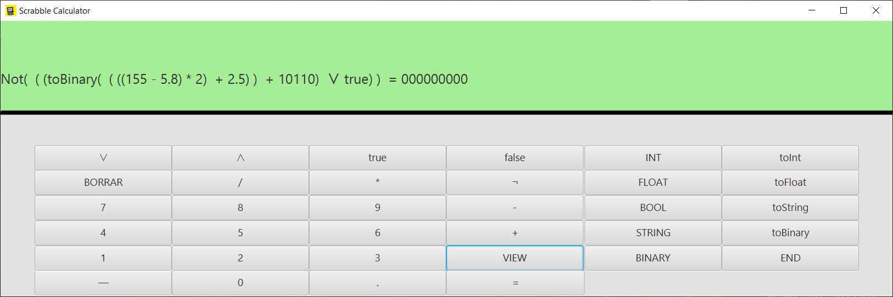

# Scrabble

Este proyecto trata sobre un lenguaje simplificado de programación inspirado en Scratch.

El siguiente código muestra la implementación de este lenguaje de programación simple con sus propios tipos y con operaciones básicas.

### *Consideraciones*

Como consideraciones a tener en cuenta para este proyecto es que no se consideran los complementos de 2 en el caso de las operaciones entre tipos binarios, además incluye en su implementación una forma de controlar la memoria del programa almacenando variables una sola vez y reutilizando las ya creadas.    
En el caso del **MVC** (modelo vista controlador) para el **modelo**, se implementan los tipos especiales de Scrabble (Bool Float, Binary, Int y string). Para el caso del **Controlador** las operaciones se cuenta con una forma de representarlas mediante el uso de árboles de sintaxis abstracta de forma de que se puede representar cualquier cálculo de forma exacta. Finalmente Para la **Vista** se crea un interfaz la cual cuenta con un ejecutable el cual despliega una calculadora que funciona mediante arboles de sintaxis abatracta para ir representanndo las distintas operacioens que se le entregan.

### *Modo de uso*

* Ejecutamos el archivo __Scrabble.java__ en el directorio `src/main/java/cl/uchile/dcc/scrabble/gui/Vista` , y se nos presentará la siguiente ventana.   

* Para crear una variable hay que _*siempre*_ indicar el tipo correspondiente de esta usando los botones: `INT`, `FLOAT`, `BOOL`, `STRING` y `BINARY`.   
  

* Al apretar el botón de tipo, si escribe el número y/o valor y finalmente _*siempre*_ declare el fin de la una variable apretando el botón `END`. Al apretar `END` en la segunda variable se ajustará la expresión a una forma más visible.   
  
  
#
* Luego si tienes un conjunto de operaciones básicas puedes obtener el resultado de la operación con el botón `=` o volver a mostrar las operaciones de forma más visible con el botón `VIEW`.   
  
  

### Otras Consideraciones:
* Para Transformar una expresión a otro tipo existen los botones `toString`,`toBinary`,`toInt` y `toFloat`.
     
  __ADVERTENCIA__ :Se necesita *al menos* una operación existente para realizar una transformación.
     
* Las operaciones __siempre se operan entre 2 variables__.
     

* En caso de cometer algún error, la calculadora lo mostrará en pantalla. Para seguir utilizando debe usar el botón `BORRAR` el cual reiniciará la calculadora.

Interactive graphic programming language heavily inspired by
[Scratch](https://scratch.mit.edu).
This work is licensed under a
[Creative Commons Attribution 4.0 International License](http://creativecommons.org/licenses/by/4.0/),
and aims purely to be used with the purpose of teaching in the context of the course
_CC3002 Metodologías de Diseño y programación_ of the
[_Computer Sciences Department (DCC)_](https://www.dcc.uchile.cl) of the
_University of Chile_.